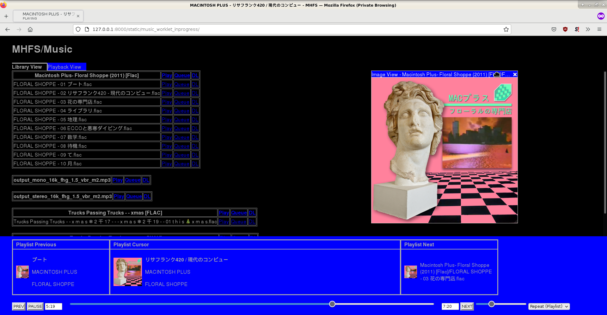

# MHFS - Media HTTP File Server
#### Stream your own music and video library via your browser and standard media players.
- HTTP/1.1 server [keepalive, byte serving, chunked encoding, and more]
- Gapless streaming web audio player using AudioWorklet and [miniaudio](https://raw.githubusercontent.com/mackron/miniaudio/master/miniaudio.h) with fallback players for incompatible browsers
- server-side audio and video transcoding
- Kodi open directory interface for playing from kodi as http source [video only currently]
- M3U8 playlist interface for easy streaming in video players such as VLC
- [Incomplete] web video players to stream your movies and tv shows in the browser
- automatic media library scanning
- `youtube-dl` web interface



## Setup

### Binary Releases

If you want to skip the setting up Perl and installing Perl modules steps, check out the `mhfs.com` binary version of MHFS in [releases](https://github.com/G4Vi/MHFS/releases). It does not have any of the extension modules, but it should run on most unix-like operating systems as it's packaged into [Actually Portable Perl](https://computoid.com/APPerl/).

### [Recommended] Optional Prerequisites
- A C compiler (needed for building MHFS::XS encoding module and Alien::Tar::Size library). `apt-get install build-essential`
- `ffmpeg` and `sox` somewhere into path. `ffmpeg` is used for transcoding in the MusicLibrary subsystem and for videos in the video subsystem. `sox` is used for resampling in the MusicLibrary subsystem. `apt-get install ffmpeg sox`
- libFLAC with headers. libFLAC is required to build the XS module [needed for server-side audio decoding and encoding]. `Alien::libFLAC` will download and build libFLAC from source if not found. `apt-get install libflac-dev`
- ssl dev libraries. needed to fetch libFLAC sources using `IO::Socket::SSL` and `Net::SSLeay`, for building the XS module if `libflac-dev` is not installed. `apt-get install libssl-dev libz-dev`

### [Recommended, Security] Create user account for MHFS

For security it's recommended to create a user account exclusively for running MHFS.

`# adduser --system mhfs` - create the daemon user and home directory

`# su - mhfs -s /bin/bash` - switch to the new `mhfs` user to continue installation

### Setup perl
Installing packages under system perl is not recommended. `local::lib` is a light-weight solution that installs libraries seperately, but still uses system perl binary. If `perl` is unavailable or you prefer to install a perl version just for mhfs, `perlbrew` is recommended.
<details>
<summary>Setup local::lib for existing perl [Recommended]</summary>
Follow the <a href="https://metacpan.org/pod/local::lib#The-bootstrapping-technique">local:: lib bootstrapping technique</a> and be sure to load it into the current shell, i.e: <code>eval "$(perl -I$HOME/perl5/lib/perl5 -Mlocal::lib)"</code>

Install cpanm: `curl -L https://cpanmin.us | perl - App::cpanminus`
</details>
or<br>
<details>
<summary>Setup perlbrew distribution</summary>

`export PERLBREW_ROOT=ABSPATHTOREPO/perl5/perlbrew` replacing `ABSPATHTOREPO` with the absolute path to the repo<br>
`curl -L https://install.perlbrew.pl | bash`<br>
`source "$PERLBREW_ROOT/etc/bashrc"`<br>
`perlbrew install perl-5.34.0`<br>
`perlbrew list`<br>
`perlbrew switch perl-5.34.0` where `perl-5.34.0` is the version listed.<br>
`perlbrew install-cpamn`

`cd /usr/include/x86_64-linux-gnu/ && h2ph -r -l . && cd sys && h2ph syscall.h && cd ABSPATHTOREPO` where `/usr/include/x86_64-linux-gnu` is the kernel header files and `ABSPATHTOREPO` is the absolute path to the repo used before.
</details>

### Download and install MHFS

###### Only `App-MHFS` is required, but the other modules are highly recommended.

From cpan [Recommended]: `cpanm --with-recommends App::MHFS`

From github: Download from [releases](https://github.com/G4Vi/MHFS/releases) and extract (`tar -xvf MHFS-VERSIONHERE.tar`). Install the perl modules: `cd MHFS-VERSIONHERE && cpanm Alien-Tar-Size*.tar.gz Alien-libFLAC*.tar.gz MHFS-XS*.tar.gz App-MHFS*.tar.gz`

### Configure settings
Start the server, `mhfs` to create the settings file: `settings.pl`

The settings file is created  at [$XDG_CONFIG_DIRS](https://specifications.freedesktop.org/basedir-spec/basedir-spec-latest.html)`/mhfs`, by default `$HOME/.config/mhfs`. Fill in your settings as needed.

`HOST` - address to bind too, i.e. `'127.0.0.1'` for localhost or `'0.0.0.0'` for all interfaces.

`PORT` - port to bind too, i.e. `8000`.

`ALLOWED_REMOTEIP_HOSTS` - whitelist to specify allowed remote ip addresses, an optional required `Host` header value, and an absolute url override if desired. By default the absolute url is derived from the `Host` header. [CIDR](https://datatracker.ietf.org/doc/html/rfc4632#section-3.1) notation is supported to allow remote ip address ranges in a single item.
```perl
'ALLOWED_REMOTEIP_HOSTS' => [
    # localhost connections for reverse proxy, use https://domain.net/mhfs to build absolute urls
    # the optional forth parameter is needed to ensure the the request came from the reverse proxy.
    # It is checked against X-MHFS-PROXY-KEY request header. It MUST be set for features requiring
    # headers (X-Forwarded-For, etc) from the reverse proxy such as MHFS::Plugin::BitTorrent::Tracker
    ['127.0.0.1', undef, 'https://domain.net/mhfs', 'SETME_SUPER_SEKRET_PLEASE'],
    ['192.168.1.0/24'], # anyone on our LAN
    ['0.0.0.0/0', 'domain.net:8000'] # direct connections with the correct Host header
],
```

`NETMAP`- a HACK for deciphering routing netmap shenigans, where clients on LAN connect with an alternative address than their real LAN address. Currently just used by `MHFS::Plugin::BitTorrent::Tracker` to properly allow peers to work both on the LAN and the internet. `[FAKE_IPV4_START, REAL_IPV4_START]`, i.e. `[10, 192]`.

`PUBLICIP` - Currently just used by `MHFS::Plugin::BitTorrent::Tracker` to expose LAN peers to the internet with the external IP address of network, i.e. `'1.1.1.1'`

`MEDIALIBRARIES` - hash of library to folder path mapping.
```perl
'MEDIALIBRARIES' => {
    'movies' => "/path/to/movies",
    'tv'     => "/path/to/tv",
    'music' => "/path/to/music",
}
```

Timeouts are used to boot idle or non-responsive connections.

`recvrequestimeout` - maximum time [in seconds] to recieve an http request line and headers. Starts when no request is active on connection. default value: `TIMEOUT`

`sendresponsetimeout` - maximum time [in seconds] allowed between `send`'s when sending an http response. default value: `TIMEOUT`

`TIMEOUT` - the default timeout value [in seconds] for the timeouts. default value: `75`

### [Recommended, Security] Prevent MHFS from modifying its own files

In the case of a `mhfs` account, you can just take ownership of it's home directory, but allow it to still own it's temp files

`# chown -R YOURUSERNAME:YOURUSERNAME /home/mhfs` - allow your account to manage the files in the `mhfs` account instead

`# mkdir -p /home/mhfs/.cache/mhfs && chown -R mhfs:nogroup /home/mhfs/.cache/mhfs`- allow mhfs to manage temp files

`# mkdir -p /home/mhfs/.local/share/mhfs && chown -R mhfs:nogroup /home/mhfs/.local/share/mhfs`- allow mhfs to save permanent files

## Usage

`mhfs`

Navigate to the url, by default `http://127.0.0.1:8080/` you are presented with a few different routes:

`/music` to enter the music library and player. See below for info on the `MusicLibrary` subsystem.

`/video` to enter the movie and tv library and player. See below for info on the `Video` subsystem.

## Advanced Setup

### Reverse Proxy
To add TLS and allow access without entering a port in the URL, reverse proxying is recommended.

Setup TLS, [Let's Encrypt certbot](https://certbot.eff.org/instructions) recommended.

#### Apache
Add the following to your site config i.e. `/etc/apache2/sites-available/000-default-le-ssl.conf` replacing `mhfs` with the name you want on your site. Set `X-MHFS-PROXY-KEY` request header to the same secret as before. Keep the trailing slashes [or absense of] the same.
```apache2
RewriteEngine On
RewriteRule ^/mhfs$ mhfs/ [R,L]
<Location "/mhfs/">
  RequestHeader set X-MHFS-PROXY-KEY SAME_SUPER_SEKRET_AS_SET_IN_CONFIG
  AddOutputFilterByType DEFLATE application/json
  AddOutputFilterByType DEFLATE text/html
  AddOutputFilterByType DEFLATE application/javascript
  AddOutputFilterByType DEFLATE text/plain
  AddOutputFilterByType DEFLATE text/css
  AddOutputFilterByType DEFLATE application/wasm
  ProxyPass "http://127.0.0.1:8000/"
</Location>
```
Reload apache2 `# service apache2 reload`. If it fails install `mod_headers`:  maybe `a2enmod headers && service apache2 restart`

### Setup as systemd service
A sample service set to use the local::lib is provided.

```bash
cp resources/mhfs.service /etc/systemd/system/mhfs.service
systemctl daemon-reload
systemctl enable mhfs.service
systemctl start mhfs.service
```

## Subsystems

### MusicLibrary subsystem

The music player is by default accessed with `/music`.

#### Music players

`/music?fmt=worklet` - `AudioWorklet` based player.
- Gapless streaming of FLAC, WAV, and MP3 without needing server-side decoding support
- Shows embedded or file based cover art.
- Shows metadata (Trackname, Artist, and Album) instead of file path.
- Keyboard based controls and MediaSession support for media key usage.

`/music?fmt=legacy` - Legacy browser player. Uses html audio tag to load and play audio.

`/music?fmt=musicinc` - Incremental gapless player. Uses `AudioBufferSourceNode`s to play audio.

#### API
`/music` Request a music player or the music library in a variety of formats. See `MusicLibrary::SendLibrary`.

`/music_dl?name=folderpath` Download a track [or part of one] by filename with optional resampling, channel mixing, and encoding. See `MusicLibrary::SendLocalTrack`.

`/music_resources?name=folderpath` Download a flac audio track's vorbis comments as json. See `MusicLibrary::SendResources`. 

### Video subsystem

The video player is accessed with `/video`.

For convenience `M3U` playlist files are provided to ease streaming outside of the browser in software such as VLC. Note, this may only work well on LAN.

#### Kodi / XBMC

Kodi may access media via http sources in kodi. MHFS attempts to provide your libraries with kodi's desired naming structures, so that it will be organized with metadata accurately.

`/kodi/movies/` - Kodi formatted *Movies* directory listing

`/kodi/tv/` - Kodi formatted *TV* directory listing

## Development Info

Install the perl dependencies from `cpanfile` with `cpanm --with-develop --with-configure --installdeps .`

emscripten is required to build the web music players (they use Wasm).

A full build is done with `make -j4`.

`./runintree.pl` allows running MHFS directly from this source code tree

`./debug.pl` terminates instances of MHFS, builds MHFS, and runs `./runintree.pl`

## Thanks
[Tejas Rao](https://github.com/trao1011) for source code review early on. [mackron](https://github.com/mackron) for great audio libraries and answering questions.

## LICENSE AND COPYRIGHT

This software is copyright (c) 2018-2022 by Gavin Hayes.

This is free software; you can redistribute it and/or modify it under
the same terms as the Perl 5 programming language system itself. See LICENSE.
